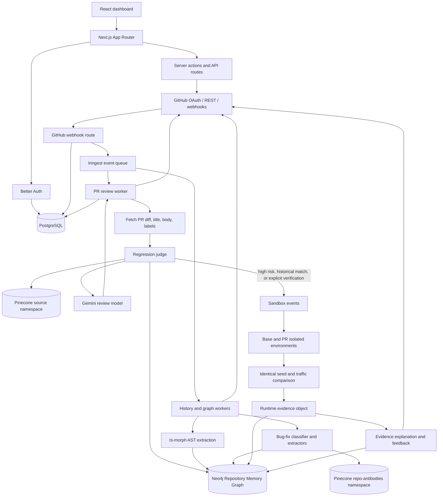

# CodePool

CodePool is a repository-aware code review assistant for GitHub. It connects repositories, receives pull-request webhooks, builds review context from the codebase and repository history, generates AI review feedback, and publishes the result back to GitHub and the CodePool dashboard.

The project is also building a Repository Memory Graph: historical fixes become reusable invariants and antibodies that can be matched against future pull requests. High-impact changes are intended to be routed to a future sandbox for executable validation.

## What it does today

- Connects GitHub repositories through Better Auth and GitHub OAuth.
- Creates and verifies GitHub webhooks for pull-request events.
- Queues asynchronous work with Inngest.
- Indexes repository source files in Pinecone for semantic retrieval.
- Mines commit history with `ts-morph` and stores repository structure in Neo4j.
- Classifies merged bug-fix PRs and extracts normalized `Invariant` and `Antibody` graph nodes.
- Adds bounded graph-impact and historical-fix context to AI PR reviews.
- Runs a provider-neutral differential sandbox pipeline when configured, compares base and PR behavior, and records runtime evidence.
- Accepts runtime feedback that can update antibody confidence and invariant lifecycle state.
- Creates GitHub check runs and comments, and stores review state in PostgreSQL.

The sandbox pipeline is implemented behind configuration. A Daytona provider is available, while the default provider intentionally fails until a managed sandbox provider is configured. The review worker only requests a sandbox run when the regression judge routes the PR to `sandbox-diff-engine` and a fixture snapshot is configured.

## Technology

- Next.js `16.3.4` and React `19.2.8` with the App Router
- TypeScript, Tailwind CSS, shadcn/Base UI, and TanStack Query
- Bun `1.4.2`
- Better Auth, Kysely, Prisma ORM Postgres contracts, and PostgreSQL
- Octokit for GitHub API access
- Inngest for background jobs
- Google AI SDK with `gemini-3.6-flash`
- Pinecone integrated records for semantic search
- Neo4j through `neo4j-driver`
- `ts-morph` for TypeScript/JavaScript AST extraction

## Architecture: Repository Memory and Sandbox

This section describes the memory and sandbox architecture separately from the current review UI. It is the main extension point for future regression validation.

## Entire application architecture



In short, PostgreSQL manages application identity and review state, GitHub owns repository/PR data, Inngest coordinates asynchronous work, Neo4j stores connected repository knowledge, Pinecone supplies semantic retrieval, Gemini supplies bounded interpretation, and the sandbox compares executable behavior when configured.

### Data ownership

```text
PostgreSQL
  Identity, OAuth accounts, connected repositories, review state, webhook deduplication

Neo4j
  Repository memory, commits, files, symbols, symbol versions,
  invariants, antibodies, impact relationships, runtime concepts

Pinecone
  Source-code semantic records and historical antibody text

GitHub
  Source of truth for repositories, commits, pull requests, issues, diffs, and check runs
```

Neo4j and Pinecone are additive. Existing PostgreSQL data and the existing source-code Pinecone path are not migrated or replaced. Historical antibodies use the separate Pinecone namespace `repo-antibodies`; each vector stores the corresponding Neo4j node ID as `neo4jId` metadata.

### Graph model

The graph keeps stable symbols separate from their changing implementations:

```text
Repository -[:HAS_COMMIT]-> Commit -[:MODIFIED]-> SymbolVersion -[:VERSION_OF]-> Symbol
Repository -[:HAS_FILE]-> File
Commit -[:TOUCHED]-> File
SymbolVersion -[:PREVIOUS_VERSION]-> SymbolVersion
SymbolVersion -[:CALLS]-> Symbol
SymbolVersion -[:READS|WRITES]-> DatabaseEntity
SymbolVersion -[:SERVES]-> Endpoint
```

Historical bug knowledge is normalized so multiple fixes can share one invariant:

```text
Antibody -[:PROTECTS]-> Invariant
Antibody -[:DERIVED_FROM]-> PullRequest -[:FIXED]-> Bug
Bug -[:VIOLATED]-> Invariant
Bug -[:REPORTED_IN]-> Issue
PullRequest -[:RESTORED]-> Invariant
Antibody -[:WATCHES]-> Symbol
Antibody -[:VERIFIED_BY]-> Test
```

All graph writes carry evidence provenance: `sourceType` is one of `ast`, `git`, `github`, `llm`, or `runtime`, and `confidence` is between `0` and `1`. LLM-derived Invariant and Antibody nodes start with `status: "candidate"`. Invariants also support `validFrom`, `validUntil`, and `supersededBy` for future deprecation and replacement.

### Memory ingestion flows

Repository structure is built from Git and AST data:

```text
repository.sync.requested
  -> GitHub commits, oldest first
  -> changed file contents at each commit
  -> ts-morph symbol/call/data/route extraction
  -> Neo4j graph writes with git/ast provenance
```

Merged bug-fix knowledge follows an event pipeline:

```text
history.mine.requested
  -> bug.classify
  -> antibody.extract.requested
  -> invariant.extract.requested
  -> Neo4j Bug/Invariant/Antibody writes
  -> Pinecone repo-antibodies upsert
```

The current history event expects a list of `HistoricalPullRequest` inputs containing the PR title/body/diff, optional linked issue, stable touched-symbol IDs, and optional regression-test IDs. Automatic discovery of all historical merged PRs is not implemented yet.

### How previous PRs become memory

Previous PRs enter the memory system through a separate historical-mining path. The important distinction is that a merged PR is not stored as one opaque text blob: its fix is linked to the symbols and behavioral rule that it changed.

```text
Historical merged PR
  -> title + body + diff + linked issue + touched Symbol IDs + regression Test IDs
  -> LLM bug-fix classification
  -> if bug fix: extract problem/root cause
  -> extract plain-English Invariant/category/severity
  -> write normalized Neo4j nodes and relationships
  -> index antibody text in Pinecone repo-antibodies
```

For a PR such as “cap refunds at the refundable balance,” the pipeline can create or reuse an `Invariant` such as “Refund amount must never exceed refundable balance,” then create an `Antibody` describing the failure and root cause. The Antibody points to the invariant, the historical `PullRequest`, the affected `Symbol` nodes, and any regression `Test` nodes. A linked `Issue` is connected through the `Bug` node.

The IDs are deterministic within a repository: pull requests use the repository/PR number, antibodies use the PR identity, and invariants use a hash of the normalized statement. This allows multiple historical antibodies to point at the same invariant rather than duplicating the rule. `Symbol` remains stable across commits; changed implementations are represented by separate `SymbolVersion` nodes linked with `PREVIOUS_VERSION`.

The historical memory is used during a future review as follows:

```text
Current PR diff
  -> identify changed symbols (currently best-effort diff parsing)
  -> traverse bounded CALLS / IMPORTS paths
  -> find Antibodies WATCHING reachable symbols
  -> retrieve their protected Invariants and historical fixes
  -> combine with static impact and Pinecone semantic matches
  -> raise the risk/routing signal when prior bug behavior is adjacent
```

The current `history.mine.requested` event expects prepared PR inputs; it is not automatically dispatched for every repository connection. The `pull_request.merged` webhook currently handles merged-commit graph ingestion, while historical PR classification/extraction must be supplied through the history event workflow.

### Review-time regression judge

```text
PR diff
  -> changed identifier extraction
  -> bounded Neo4j blast-radius lookup
  -> bounded historical antibody lookup
  -> Pinecone semantic retrieval
  -> weighted impact score
  -> standard-review or sandbox-diff-engine tier
  -> AI review prompt
```

Traversal is intentionally bounded: `CALLS` up to 4 hops, `IMPORTS` up to 3 hops, and data dependencies up to 2 hops. The score is a routing heuristic, not proof of a runtime regression. Graph and Pinecone failures currently degrade the context so ordinary reviews can continue; production observability and sandbox execution remain future work.

### Sandbox differential execution

The implemented provider-neutral pipeline follows this flow:

```text
Regression judge
  -> high score or historical resurrection
  -> provider provisions separate base and PR environments
  -> check out base and PR SHAs
  -> seed isolated database and Redis state identically
  -> replay the same HTTP scenarios against both branches
  -> compare JSON bodies, statuses, headers, latency, and optional database state
  -> write runtime evidence back to Neo4j
  -> explain evidence and optionally post a GitHub comment
```

The pipeline is in `module/execution`. It has a provider-neutral `SandboxProvisioner` contract and a Daytona implementation selected with `SANDBOX_PROVIDER=daytona`; without that setting it uses a deliberate `NotImplementedProvisioner`. Inngest coordinates `sandbox.build.requested`, `sandbox.ready`, `differential-run.requested`, and `differential-run.completed`. The runtime model uses `Scenario`, `ExecutionRun`, `Observation`, `Finding`, and `IncidentObservation` concepts; current evidence persistence writes runtime `Antibody`/`IncidentObservation` links.

The review path is gated by `SANDBOX_FIXTURE_SNAPSHOT`, so a normal deployment does not attempt arbitrary execution accidentally. The current fixture/verification path is the most reliable way to exercise the differential engine. Any production provider must isolate untrusted code, enforce resource/time/network policies, use separate state for base and PR, and distinguish observed failures from heuristic risk signals.

## Local setup

### Prerequisites

Install Bun `1.4.2` or a compatible recent Bun version. You also need access to:

- PostgreSQL 15 or newer
- A Google AI API key
- A Pinecone index configured for integrated records
- Neo4j for graph operations
- A GitHub OAuth application and webhook-capable public URL for webhook testing
- Inngest local development tooling or an Inngest deployment

### Install

```bash
bun install
Copy-Item .env.example .env
```

On macOS/Linux, replace the copy command with `cp .env.example .env`.

Fill in `.env` with real values. Never commit `.env` or place credentials in source files.

Initialize PostgreSQL using the project’s Prisma contract/migration commands:

```bash
bun run db:setup
```

Start the application:

```bash
bun run dev
```

The app is available at [http://localhost:3000](http://localhost:3000).

Run Inngest separately during local development:

```bash
bun run inngest:dev
```

For GitHub webhook testing, use a public tunnel and set `NEXT_PUBLIC_BASE_URL` to the resulting HTTPS URL:

```bash
bun run dev:tunnel
```

## Environment variables

The complete variable names are maintained in `.env.example`.

```text
DATABASE_URL=<PostgreSQL connection string>
BETTER_AUTH_SECRET=<Better Auth secret>
BETTER_AUTH_URL=<application URL>
NEXT_PUBLIC_BETTER_AUTH_URL=<optional browser URL override>
NEXT_PUBLIC_BASE_URL=<public HTTPS URL for GitHub webhooks>

GITHUB_CLIENT_ID=<GitHub OAuth client ID>
GITHUB_CLIENT_SECRET=<GitHub OAuth client secret>
GITHUB_WEBHOOK_SECRET=<webhook signing secret>

GOOGLE_GENERATIVE_AI_API_KEY=<Google AI API key>
PINECONE_DB_API_KEY=<Pinecone API key>
PINECONE_INDEX=<Pinecone index name>
PINECONE_TEXT_FIELD=<optional integrated-record text field; defaults to text>

NEO4J_URI=<Neo4j URI>
NEO4J_USER=<Neo4j username>
NEO4J_PASSWORD=<Neo4j password>

# Required when SANDBOX_PROVIDER=daytona
SANDBOX_PROVIDER=<daytona or leave unset>
DAYTONA_API_KEY=<Daytona API key>
DAYTONA_API_URL=<optional Daytona API URL>
DAYTONA_TARGET=<Daytona target>
DAYTONA_REPO_URL=<repository URL used by the sandbox>
DAYTONA_REPO_SLUG=<safe repository slug>
DAYTONA_COMPOSE_TEMPLATE=<Docker Compose template path>
DAYTONA_UPSTASH_REDIS_REST_URL_BASE=<isolated base Redis URL>
DAYTONA_UPSTASH_REDIS_REST_TOKEN_BASE=<isolated base Redis token>
DAYTONA_UPSTASH_REDIS_REST_URL_PR=<isolated PR Redis URL>
DAYTONA_UPSTASH_REDIS_REST_TOKEN_PR=<isolated PR Redis token>
DAYTONA_DATABASE_URL=<isolated sandbox database URL>
SANDBOX_FIXTURE_SNAPSHOT=<fixture path/content used to trigger review sandbox runs>
SANDBOX_FIXTURE_VERSION=<fixture version label>
```

`DAYTONA_CHECKOUT_TOKEN` and `DAYTONA_REPO_ARCHIVE_URL` are optional checkout alternatives. Resource and timeout settings such as `DAYTONA_CPU`, `DAYTONA_MEMORY_GB`, `DAYTONA_DISK_GB`, `DAYTONA_OPERATION_TIMEOUT_SECONDS`, `DAYTONA_EXECUTION_TIMEOUT_SECONDS`, `DAYTONA_TTL_MINUTES`, and `DAYTONA_NETWORK_BLOCK_ALL` are also supported; see `.env.example` and `module/execution/sandbox/daytona-provisioner.ts`.

The code also accepts `PINECONE_API_KEY`. `MODELSCOPE_API_KEY` remains in the example file for legacy naming, but the current review and extraction implementation uses Google Gemini.

## Application flow

```text
User connects a repository
  -> Better Auth verifies the user
  -> PostgreSQL stores the repository
  -> GitHub webhook is created
  -> Inngest queues source indexing and history synchronization

GitHub opens or updates a PR
  -> webhook signature and delivery ID are verified
  -> GitHub check run is created
  -> pr.review.requested is queued
  -> PR diff and repository context are loaded
  -> regression judge builds graph/history/vector context
  -> Gemini generates the review
  -> GitHub comment/check run and PostgreSQL review are updated

GitHub merges a PR
  -> pull_request.merged is queued
  -> the merge commit’s changed files are added to the graph
```

## Project structure

```text
app/                         Next.js routes, pages, API routes, Inngest endpoint
components/                  Shared UI and shadcn-style components
hooks/                       React hooks
inngest/                     Inngest client
lib/                         Auth, Pinecone, model/review helpers, shared types
module/ai/                   RAG and structured AI helpers
module/github/               Octokit integration
module/knowledge-graph/      AST, history, graph client/writer, schema, impact
  module/regression/           Judge context and impact scoring
  module/execution/             Sandbox provisioning, traffic replay, diff evidence, and cleanup
module/repository/           Repository connection actions/hooks/components
module/reviews/              Review UI and actions
src/prisma/                  PostgreSQL contract and generated/runtime access
migrations/                  PostgreSQL migration artifacts
  scripts/                     Service-backed graph, ingestion, sandbox, and evidence verification scripts
```

## Useful commands

```bash
# Development
bun run dev
bun run inngest:dev
bun run dev:tunnel

# Quality checks
bun test
bun run lint
bunx tsc --noEmit --incremental false

# Production build
bun run build
bun run start

# PostgreSQL/Prisma
bun run db:generate
bun run db:init
bun run db:migrate
bun run db:status
bun run db:setup

# Neo4j/Pinecone verification fixtures
bun run verify:graph
bun run verify:ingestion
bun run verify:antibodies
bun run verify:impact
bun run verify:sandbox-diff
bun run verify:daytona
bun run verify:evidence-loop
```

The verification scripts require configured services. `verify:antibodies` uses deterministic fixtures for the extraction results but still writes to Neo4j and Pinecone.

## Current limitations

- A production-grade Sandbox Diff Engine/provider rollout is incomplete; the provider-neutral differential pipeline and Daytona adapter exist, but safe deployment still requires provider configuration and operational hardening.
- The sandbox differential pipeline exists, but managed execution requires provider configuration; the default provider is intentionally unavailable.
- Impact analysis has not been validated against a live Neo4j/Pinecone deployment in the current development environment.
- Import relationship resolution needs ordering and nested-module-resolution fixes.
- Changed-symbol detection is currently best-effort regex parsing of the unified diff; body-only edits may not resolve to graph symbols.
- Full history mining is API-expensive and lacks checkpoints/backoff.
- Neo4j and Pinecone writes are not distributed-transactional; reconciliation is future work.
- The UI does not yet display impact scores, graph evidence, antibody matches, or sandbox results.
- Runtime feedback updates graph confidence/status but is not yet a complete reviewer-facing feedback UI.

## Development notes

Read [HANDOFF.md](HANDOFF.md) before continuing architecture work. It records the verified git state, known bugs, service-blocked tests, recent commits, and the recommended next action.

Do not use destructive git commands to discard existing work. Keep graph traversal bounded, preserve provenance fields, keep `Symbol` and `SymbolVersion` separate, and do not migrate existing PostgreSQL or source-code Pinecone data as part of memory/sandbox development.
